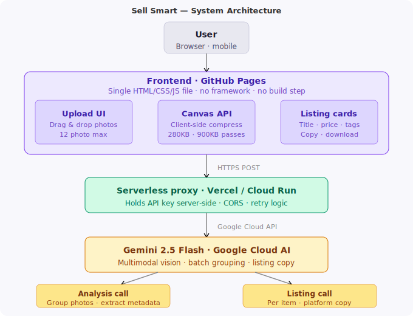

# Sell Smart — AI-Powered Resale Listings

> Built for the GDG London IWD 2026 Hackathon — "Build with AI"

This is Sell Smart...

Sell Smart helps people turn product photos into ready-to-post second-hand listings using AI.

A user uploads photos, the app automatically groups images of the same item, analyses the product, and generates a title, description, suggested resale price, tags, and category in seconds.

It also adapts the listing style for platforms like Vinted, eBay, Depop, and Facebook Marketplace, and gives a price confidence rating with a brief explanation.

So instead of manually writing every listing, users get polished, platform-ready resale content almost instantly.”


## What it does

Upload photos of your second-hand items and Sell Smart generates a complete, ready-to-post listing for you:

- **Title** — catchy and searchable
- **Description** — detailed and honest
- **Suggested resale price**
- **Estimated RRP**
- **Tags** for discoverability
- **Category** matched to the selected platform

Supports **Vinted, eBay, Depop, and Facebook Marketplace** formatting.

## The smart part: automatic photo grouping

Upload up to **10 photos** across multiple items and Sell Smart works out which photos belong to the same product.

Instead of generating one request per image and one more request per grouped item, the app now uses a more efficient two-step flow:

1. **Batch image analysis**
    - All uploaded images are compressed once in the browser
    - Gemini analyses them together in a single batch
    - It returns grouped items with structured metadata such as:
        - brand
        - model
        - product type
        - colour
        - condition
        - gender
        - size
        - product signature

2. **Listing generation from metadata**
    - Each grouped item is then turned into a final listing using its metadata
    - This avoids re-uploading the same images repeatedly
    - The result is faster generation, lower quota usage, and better reliability

Each grouped item becomes one listing.

## Future Improvements
* Chatbot for customer support and onboarding guidance
* Explore whether the information / feedback section should remain a modal or evolve into a conversational help interface
* Create a mobile app version of Sell Smart for faster photo capture and listing creation
* Improve privacy controls around uploaded images (e.g., automatic deletion, clearer messaging that images are compressed client-side)
* Enhance pricing suggestions by incorporating external resale signals such as marketplace demand or sold-listing data
* Integrate a live foreign exchange API so currency switching reflects real-time exchange rates instead of static values
* Improve product recognition accuracy (brand detection, logo recognition, model identification)
* Provide listing quality scoring to help users optimise their resale listings
* Enable bulk export formats such as CSV for marketplace bulk uploads
* Explore direct integrations with resale platforms (eBay, Vinted, etc.) for one-click listing publishing

## Architecture



## Tech stack

| Layer | Tool |
|---|---|
| AI image analysis | **Google Gemini 2.5 Flash Lite** |
| AI listing generation | **Google Gemini 2.5 Flash** |
| Frontend | Vanilla HTML/CSS/JS (single file, no build step) |
| Backend proxy | Vercel Serverless Function |
| Hosting | GitHub Pages + Vercel |

## How to run

### Option 1 — Frontend on GitHub Pages + backend on Vercel
This is the recommended setup.

1. Push this repo to GitHub
2. Deploy the repo to **Vercel**
3. Add your Gemini API key in Vercel as an environment variable:
    - `GEMINI_API_KEY=your_new_key_here`
4. Make sure the frontend calls your Vercel API endpoint
5. Enable GitHub Pages for the frontend if desired

### Option 2 — Deploy everything from the same repo
You can use the same GitHub repo for both:

- **GitHub Pages** serves `index.html`
- **Vercel** serves the secure API proxy in `api/gemini.js`

## How the AI flow works

```text
1. User uploads up to 12 photos
   → Images are compressed once in the browser and cached

2. Batch analysis request
   → All images are sent together to Gemini
   → Gemini returns grouped item metadata:
      {
        groupId,
        photoIndexes,
        brand,
        model,
        productType,
        color,
        condition,
        gender,
        size,
        productSignature
      }

3. Listing generation request
   → Each grouped item is sent as metadata only
   → Gemini returns listing JSON:
      {
        title,
        description,
        suggestedPrice,
        rrp,
        condition,
        category,
        tags
      }

4. UI renders one final resale listing per grouped item